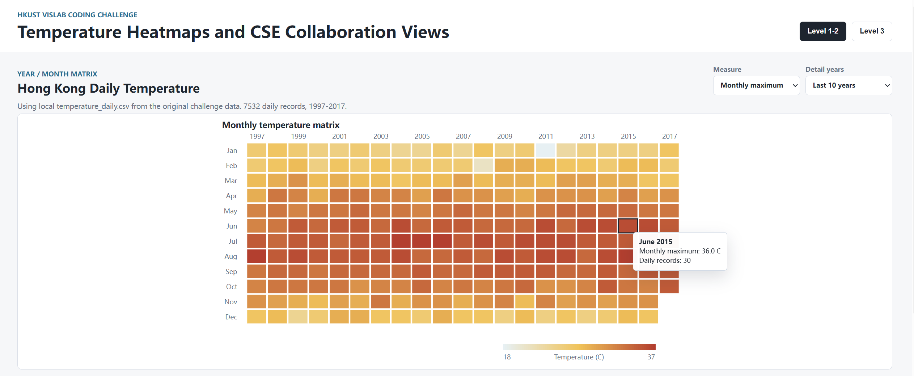
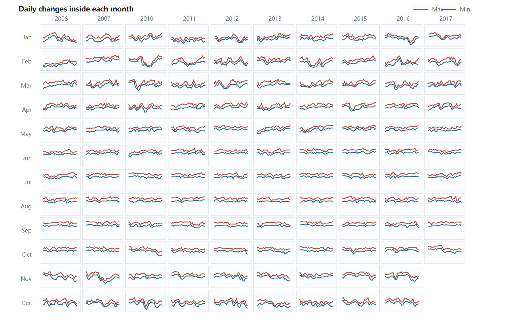
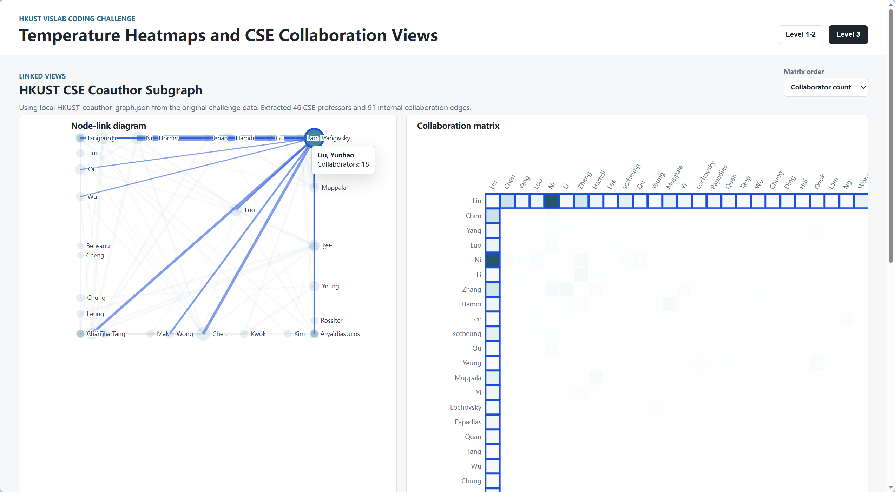

# HKUST VISLab Coding Challenge 实现过程笔记

## 题目内容

Level 1 要把香港每日温度数据整理成“年 x 月”的矩阵热力图。每个格子代表某一年某一月，颜色代表这个月的最高温或最低温。用户可以切换指标，鼠标悬停时看到具体月份和温度，旁边还要有图例说明颜色和数值的对应关系。

Level 2 是在 Level 1 的基础上增加细节。原来的一个格子只表达一个月的汇总值，但一个月内部每天也会波动，所以这里要在最近 5 到 10 年的每个月格子里画迷你折线图。横轴是日期，纵轴是温度，两条线分别表示每日最高温和每日最低温。

Level 3 换成图数据。原始 JSON 有 `nodes` 和 `edges`：节点是教授，边是合作关系，边上的 `publications` 数组表示合作论文。题目要求先筛选出 CSE 教授组成的子图，然后同时画两种视图：node-link diagram 和 matrix view。两个视图之间要联动：悬停节点时矩阵对应行列高亮，悬停矩阵单元时网络图中对应节点和边高亮。

## 涉及知识点

数据预处理：

- CSV 解析：把 `date,max_temperature,min_temperature` 读成 JavaScript 对象。
- 日期拆分：从 `YYYY-MM-DD` 得到 year、month、day。
- 分组聚合：按 year-month 分组，计算每月最高温、每月最低温。
- JSON 图数据过滤：从所有教授中筛出 `dept === "CSE"` 的节点，再筛出 CSE 内部边。

视觉编码：

- 位置编码：热力图中 x 方向表示年份，y 方向表示月份。
- 颜色编码：温度或合作次数越高，颜色越深。
- 尺寸编码：Level 3 节点半径表示该教授的合作者数量。
- 折线编码：Level 2 中折线形状表达一个月内每天温度的变化趋势。

交互设计：

- Tooltip：鼠标悬停显示当前格子或节点的详细信息。
- 指标切换：Level 1 可以在最高温和最低温之间切换。
- Linked highlighting：两个视图显示同一批 CSE 合作数据，悬停一处时另一处同步高亮。
- 排序：矩阵可以按合作者数量或姓名排序，让结构更容易被观察。

工程实现：

- `index.html`：定义页面结构、控件和 SVG 容器。
- `styles.css`：控制布局、颜色、tooltip、节点和矩阵的高亮状态。
- `app.js`：负责读取数据、聚合数据、生成 SVG 元素、处理交互。
- `server.js`：提供本地静态服务器，让浏览器可以通过 HTTP 读取 CSV 和 JSON。

## 实现效果预览

Level 1 的效果如下。这个视图主要是年-月矩阵热力图，横向是年份，纵向是月份，每个格子的颜色表示对应月份的温度值。右上角的 `Measure` 可以在 monthly maximum 和 monthly minimum 之间切换，用来对比每个月的最高温和最低温；鼠标悬停到格子上时，会显示对应月份、温度值和这个月的数据条数。

Level 2 的效果如下。这里保留了年-月矩阵的结构，但每个格子里面变成了一个小折线图，用来展示这个月内部每天的温度变化。右上角的 `Detail years` 可以选择 last 5 / 8 / 10 years，所以可以控制展示最近多少年的日变化细节。红色线表示每日最高温，蓝色线表示每日最低温。

Level 3 的效果如下。左边是 CSE 导师合作网络图，右边是对应的合作矩阵。鼠标悬停在某个导师节点上时，矩阵中这个导师对应的行和列会高亮；鼠标悬停在矩阵单元上时，左侧网络图里对应的两个导师和他们之间的合作边会高亮。右上角的 `Matrix order` 可以在 collaborator count 和 name 之间切换，用来按合作者数量或姓名重新排列矩阵。

## 实现步骤

1. 创建页面骨架。

   页面分成两个主 tab：`Level 1-2` 和 `Level 3`。

2. 读取数据。

   程序会优先读取当前目录下的 `temperature_daily.csv` 和 `HKUST_coauthor_graph.json`。如果文件不存在，会生成 demo 数据。

3. 实现 Level 1 热力图。

   `buildMonthlyData()` 把每日记录按 year-month 分组。每个分组中：

   - `max` 是这个月所有每日最高温里的最大值。
   - `min` 是这个月所有每日最低温里的最小值。
   - `days` 保留这个月每天的数据，供 Level 2 使用。

   `renderHeatmap()` 再把这些月度数据映射到 SVG 矩形。年份决定 x，月份决定 y，温度值决定 fill color。

4. 实现 Level 2 小折线。

   `renderDailyLines()` 只取最近 5、8 或 10 年。每个 year-month 单元内部再画两条折线：

   - 红色线：每日最高温。
   - 蓝色线：每日最低温。

5. 实现 Level 3 CSE 子图。

   `prepareCseGraph()` 先筛选 CSE 节点，再保留两端都属于 CSE 的合作边。每条边的合作次数来自 `publications.length`。

   节点的 `degree` 是它连接到多少位 CSE 合作者。这个值会映射到 node-link 图里的节点半径。

6. 画 node-link diagram。

   `runForceLayout()` 使用简化版力导向布局：节点之间互相排斥，合作边像弹簧一样拉近两个节点，最后再轻轻拉回画布中心。这样图不会挤在一起，也能体现合作关系。

7. 画 matrix view。

   矩阵的行列都是 CSE 教授。某个单元 `(A, B)` 表示 A 和 B 的合作次数。颜色越深，合作越多。矩阵可以按合作者数量排序，也可以按姓名排序。

8. 加联动高亮。

   两个视图共享同一份 CSE 图数据。悬停 node-link 的节点时，矩阵中对应教授的整行和整列会突出；悬停矩阵单元时，node-link 中对应两个节点和它们之间的边会突出。

